# 언어의 역사성 게임

제목: 『박태민뎐』 2023

# Day 1

- 전체적인 틀

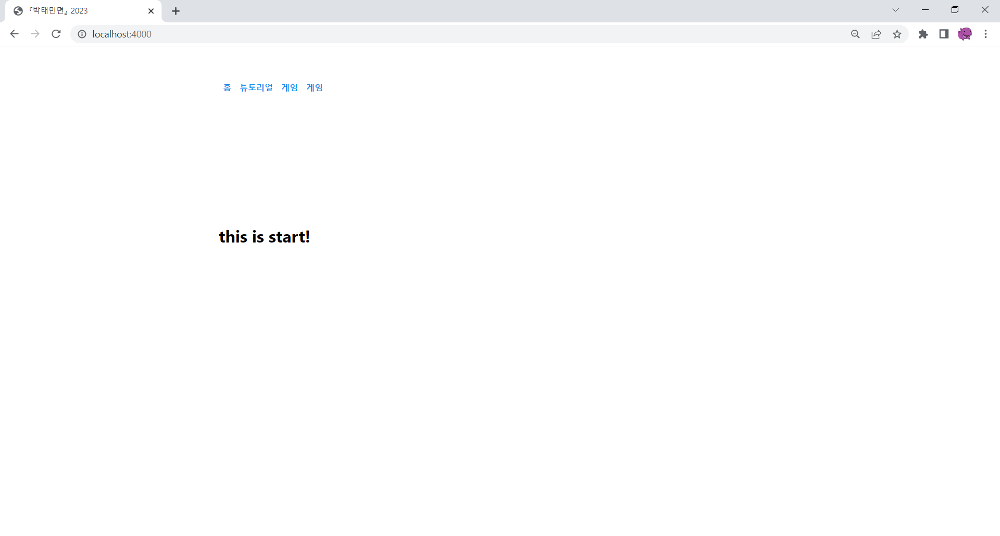

# Day 2

- 몇몇 pug 파일 생성 & 수정
- client 폴더 생성 => js 폴더 & css 폴더 생성
- 3초마다 비눗방울 생성

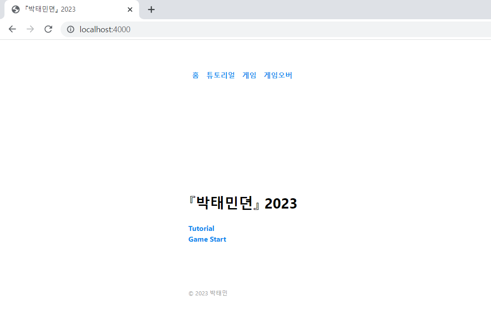
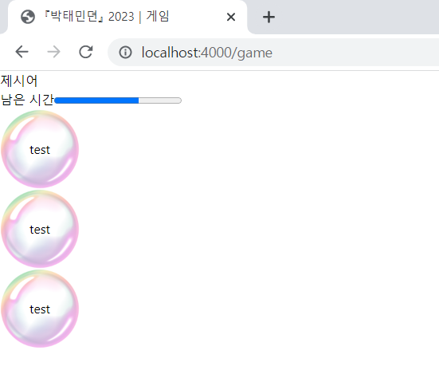

# Day 3

- 시간이 없는 관계로 게임 개발에 필요한 정보를 구글&유튜브에서 찾아보았다

# Day 4

- 비눗방울의 높이 무작위화
- 비눗방울의 이동방향 무작위화
- 비눗방울의 이동시간 무작위화
- 비눗방울의 이동 전 지연시간 무작위화

<a href="https://youtu.be/HwGZrWtMuww">동영상 링크</a>
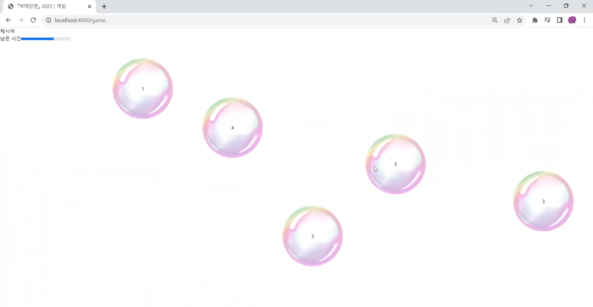

# Day 5

- 비눗방울 클릭 시 "POP!"이라는 글씨와 함께 비눗방울이 없어진다

<a href="https://youtu.be/c8gdUXwNl04">동영상 링크</a>
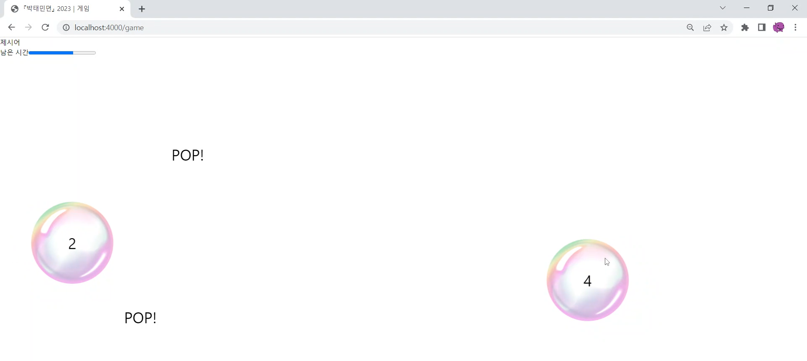

# Day 6

- 워터파크 가서 놀고온 관계로 휴식

# Day 7

- 비눗방울 클릭 시 점수판에 50점이 더해진다

<a href="https://youtu.be/MLAEZjE0El0">동영상 링크</a>
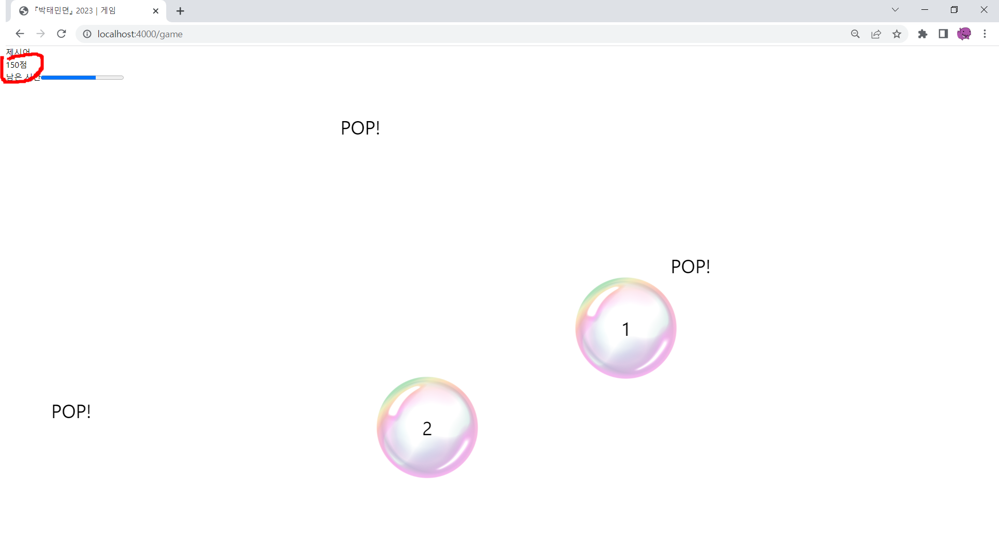

# Day 8

- 게임 시작시 진행바에 시간이 가며 시간이 다 지나면 게임 오버 화면으로 이동된다

<a href="https://youtu.be/Xj5Z9qDocuU">동영상 링크</a>

# Day 9 ~ 11

- 공휴일인 관계로 휴식
- 시간이 없는 관계로 휴식

# Day 12

- 게임에 사용할 단어들을 저장하는 파일 생성

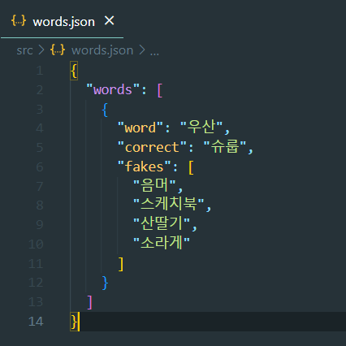

# Day 13

- 제시어에 현대에 사용되는 단어가 나온다
- 제시어의 옛말이 적힌 비눗방울과 가짜 단어가 적힌 비눗방울들이 나온다
- 정답 비눗방울을 터뜨리면 200점이 오르고 가짜 비눗방울을 터뜨리면 50점이 떨어진다
- 게임시간을 1분으로 늘렸다

<a href="https://youtu.be/MX-424Vp82I">동영상 링크</a>
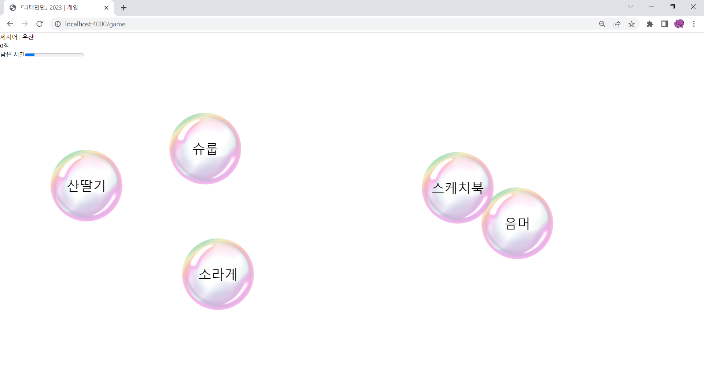

# Day 14

- 제시어를 늘렸다
- 비눗방울이 끝에 다다르거나 비눗방울을 터뜨렸을때 다른 비눗방울들도 터진 후 사라진 뒤 새로운 제시어가 나온다

<a href="https://youtu.be/4U6ICw0L_UU">동영상 링크</a>
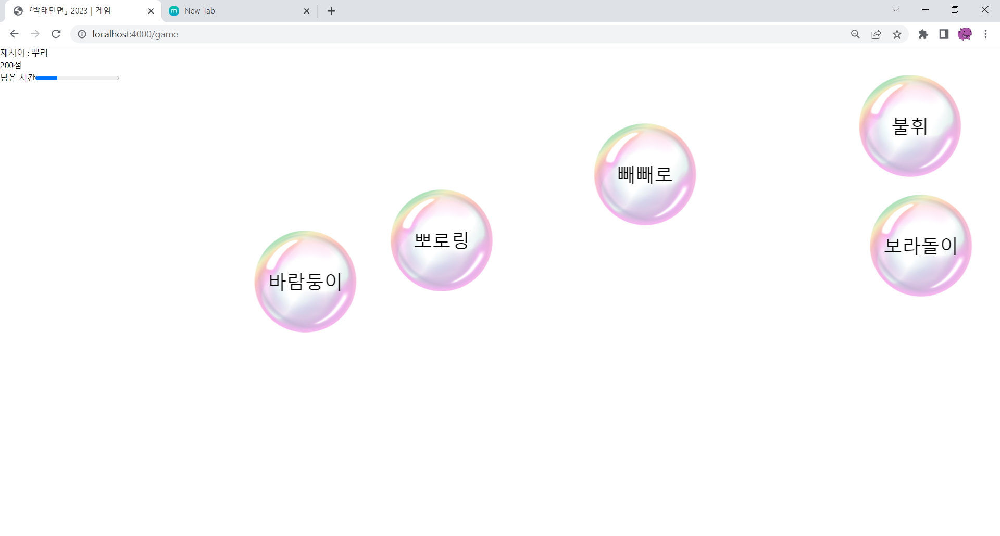
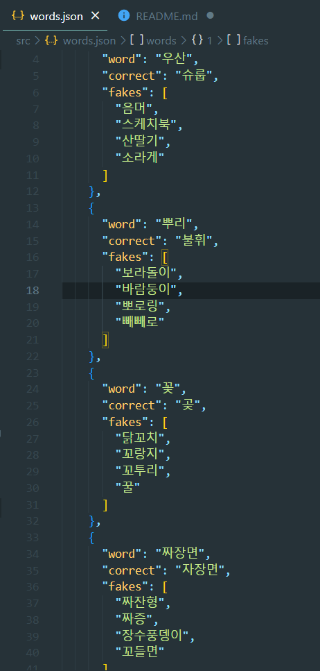

# Day 15

- 제시어를 한 개 추가했다

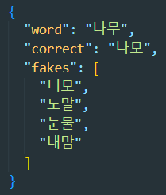

# Day 16 ~ 18

- 시간이 없는 관계로 휴식

# Day 19

- 게임오버 화면에서 최종 점수가 나온다

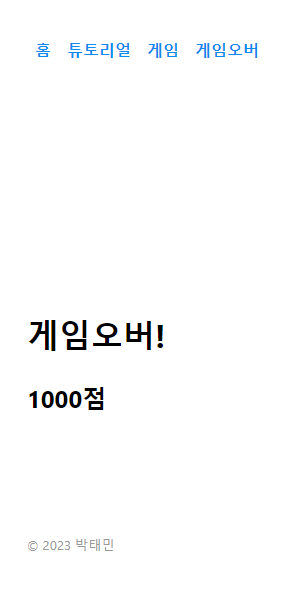

# Day 20

- 엔딩 크레딧 페이지를 만들었다 (현재 작동 X)

<a href="https://youtu.be/WfKJdYj3AWY">동영상 링크</a>
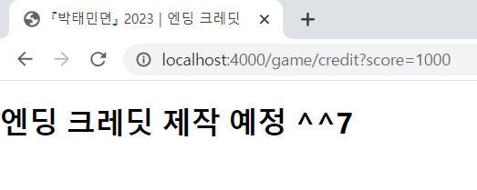

# Day 21

- 시간이 없는 관계로 휴식

# Day 22

- 점수가 1000점 이상일때만 엔딩 크레딧 페이지로 이동하도록 수정

# Day 23 ~ 28

- 휴식